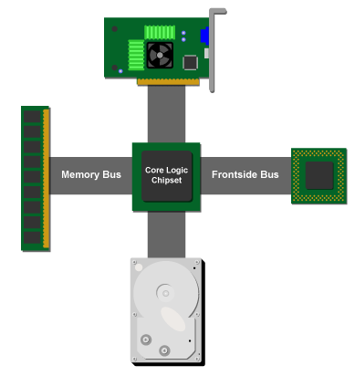
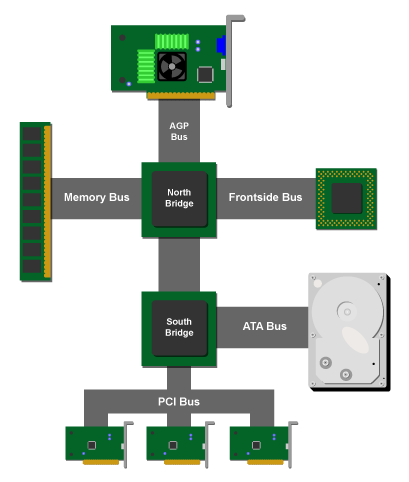
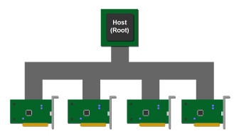

# PCI Express 概览

[原文 PCI Express : An Overview](http://archive.arstechnica.com/paedia/p/pci-express/m-pcie-1.html),这篇文章写于2004年7月1日,时间比较久远.
注: 原文url尾部部分是(m-pcie-[1-7].htm)格式,大家自己访问的时候如果碰到404,请自己替换.

随着Intel 的 900系列芯片的发布和最新的SLI回归显卡,PCI Express 终于彻底的来到了电脑爱好者的面前.支持PCI Express的主板变得越来越普遍,新型总线不断普及,同样的也会带来新技术变革的混乱,例如PCI Express 这种复杂、特性丰富的技术.在这篇文章中,我们会详细探究PCI Express特性:它是什么，它不是什么，以及它如何改进历史悠久的互连方案：PCI。

## 基本的PC系统架构

毫无疑问，大多数读者都熟悉PC系统的基本布局，但为了为下面的讨论奠定基础，做一个简短的回顾是值得的。

从逻辑上讲，一个普通的PCI系统的布局方式如下：

核心逻辑芯片组充当交换机或路由器，并在构成系统的不同设备之间路由I/O流量.

实际上,核心逻辑芯片组分成两部分:北桥和南桥(又称I/O桥).这样划分的理由很多,最重要的是让CPU、主存和显卡这三种需要彼此快速访问的设备能紧密的结合在一起.在现代系统中,GPU可以看做第二个CPU,所以它需要和CPU共享主存的访问特权,所以这三个设备都放到了北桥里面.

北桥连接了用来传递系统中不同I/O设备流量的南桥,设备包括:硬盘驱动器、USB端口、以太网端口等.设备的流量先从南桥路由到北桥,然后在到CPU/内存上.

显然从上面的图可以看出,PCI bus被连接到南桥.在现代操作系统中,这个总线通常是最老最慢最需要升级的那个总线.

就目前而言，你应该从前面的图表中删除的主要内容是现代PC中由各种协议和带宽功能组成的专用总线。 旨在将不同类型的硬件直接连接到南桥的专用总线组合是一种不断发展的尝试，但它已经逐渐由PC行业共同设计，因为它试图克服老化PCI总线的局限性。由于PCI总线不能如同SATA、火线那样直接切断,所以趋势是将内外部的I/O接口直连南桥.所以今天的南桥就如同瑞士军刀一样,并且得益于摩尔定律,它已经能够以新接口的形式不断添加功能，从而避免需要带宽的设备在PCI总线上挨饿。

在理想世界中,会有一种类型的总线出现,它只需要一种协议就可以连接所有不同类型的设备(甚至包括GPU)到CPU和主存中.当然,这种"七彩祥云"版理想是不会在现实世界发生的.PCI Eexpress不行,Infiniband也不行(尽管从技术角度上,如果我们扔掉所有历史硬件,是可以基于Infiniband兼容的设备从头来组装PC的).

尽管上面的乌托邦版的理想永远不会实现,但是我们还是可以在混沌中找出一些秩序.比如现在的PCI Express(缩写PCIe).

随着Intel的900系列芯片组发布和 N/A卡支持PCIe,PCIe即将进入消费市场.本文将会介绍接下来十年主宰市场的总线技术.

注:本文不会过多地介绍服务器特定的PCIe特性,比如热插拔,数据包重试等.

## PCI简史

在深入了解PCIe之前,了解PCI如何工作和它的局限在哪会对后面的理解很有帮助.

10年,PCI总线首次推出的是33MHz的32位总线,理论带宽峰值为132MB/s.这在当时相当不错,但随着系统的其他部分需要更多带宽,总线速度和总线宽度都在不断提高,后来的PCI包括一个64位、33MHz总线组合,峰值带宽为264MB/s;最新的64位66MHz组合,带宽为512MB/s。

PCI使用共享总线技术来允许不同设备间在总线上的互相通信;不同的PCI设备(网卡、声卡、RAID卡)被接到了相同的总线上,并与CPU进行通信.看一下下面的图有个大概的感受.

由于所有的设备都连接到总线上,所以需要一种仲裁机制来决定什么时候、谁来访问总线,尤其是在碰到多个设备同时访问总线的情况下.一旦一个设备控制的总线,它就是bus master,它能用PCI bus来通过南桥和cpu/memory通信.

说到南桥,

