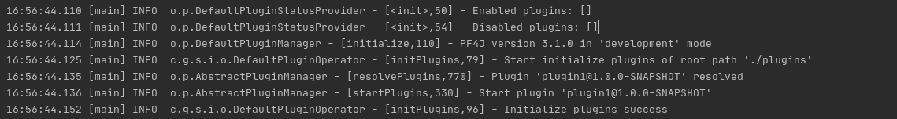
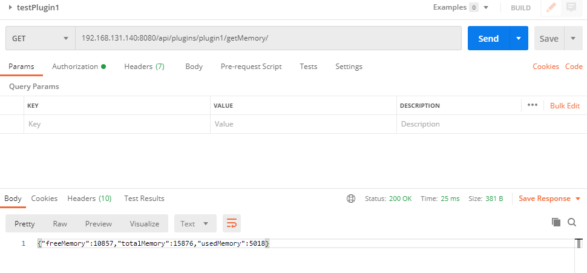
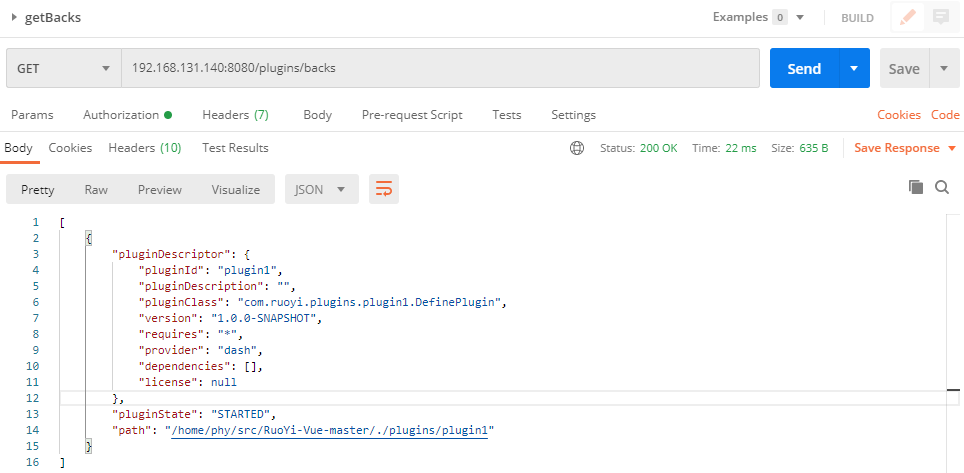
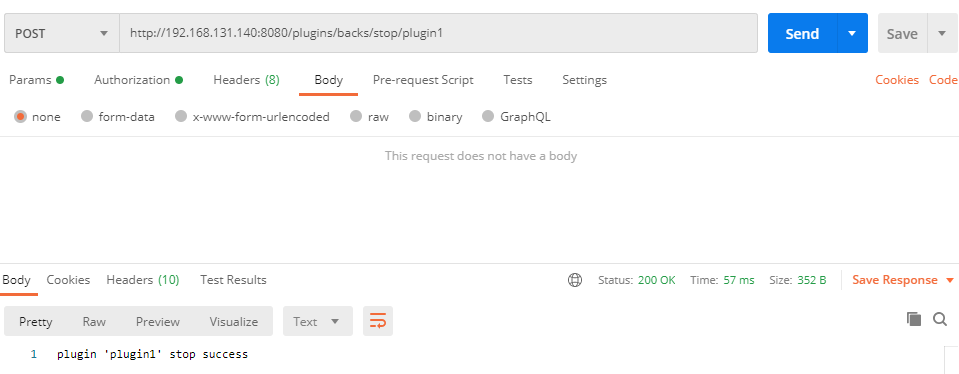
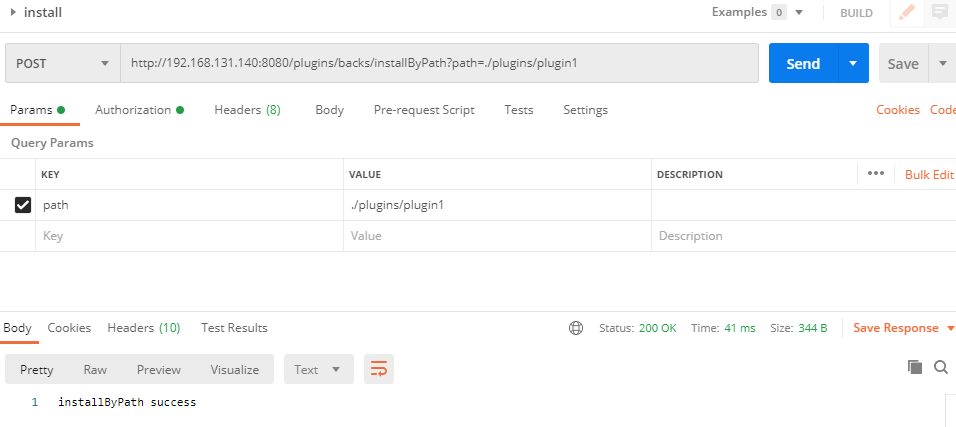
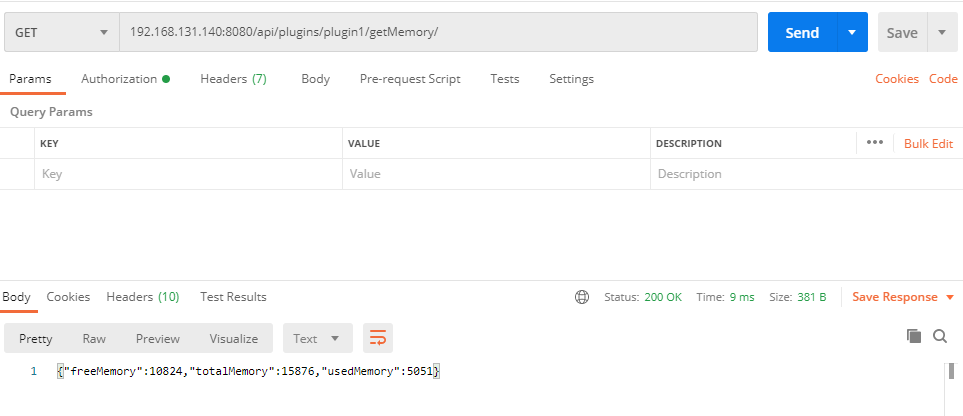

#### 1.主程序集成

##### 1.1配置文件修改

###### 1.1.1在主程序中添加

```
<dependency>
	<groupId>com.gitee.starblues</groupId>
	<artifactId>springboot-plugin-framework</artifactId>
	<version>2.2.0-RELEASE</version>
</dependency>
```

ps: 当前用的是这个版本，更高版本的还没试过。


###### 1.1.2修改application.yml文件

增加配置

```
plugin:
	runMode: dev
	pluginPath: ./plugins
	pluginConfigFilePath:
```


runMode是运行模式，有两个可选值 dev、prod

pluginPath是插件放置的文件夹路径

pluginConfigFilePath插件配置文件路径，是上传插件配置文件时用到推荐不填


##### 1.2增加PluginApplication实例

###### 1.2.1新建类PluginConfig

在ruoyi-admin中新建类

```
@Configuration
public class PluginConfig {
    @Bean
    public PluginApplication pluginManager(){
        return new AutoPluginApplication();
    }
}
```

AutoPluginApplication类就是插件管理的主程序。


###### 1.2.2新建类PluginConfiguration

在ruoyi-admin中新建类

```
@Component
@ConfigurationProperties(prefix = "plugin")
public class PluginConfiguration extends DefaultIntegrationConfiguration {
    /**
     * 运行模式
     *  开发环境: development、dev
     *  生产/部署 环境: deployment、prod
     */
    @Value("${runMode:dev}")
    private String runMode;

    /**
     * 插件的路径
     */
    @Value("${pluginPath:plugins}")
    private String pluginPath;

    /**
     * 插件文件的路径
     */
    @Value("${pluginConfigFilePath:pluginConfigs}")
    private String pluginConfigFilePath;


    @Override
    public RuntimeMode environment() {
        return RuntimeMode.byName(runMode);
    }

    @Override
    public String pluginPath() {
        return pluginPath;
    }

    @Override
    public String pluginConfigFilePath() {
        return pluginConfigFilePath;
    }

    /**
     * 重写上传插件包的临时存储路径。只适用于生产环境
     * @return String
     */
    @Override
    public String uploadTempPath() {
        return "temp";
    }

    /**
     * 重写插件备份路径。只适用于生产环境
     * @return String
     */
    @Override
    public String backupPath() {
        return "backupPlugin";
    }

    /**
     * 重写插件RestController请求的路径前缀
     * @return String
     */
    @Override
    public String pluginRestControllerPathPrefix() {
        return "/api/plugins";
    }

    /**
     * 重写是否启用插件id作为RestController请求的路径前缀。
     * 启动则插件id会作为二级路径前缀。即: /api/plugins/pluginId/**
     * @return String
     */
    @Override
    public boolean enablePluginIdRestControllerPathPrefix() {
        return true;
    }


    public String getRunMode() {
        return runMode;
    }

    public void setRunMode(String runMode) {
        this.runMode = runMode;
    }


    public String getPluginPath() {
        return pluginPath;
    }

    public void setPluginPath(String pluginPath) {
        this.pluginPath = pluginPath;
    }

    public String getPluginConfigFilePath() {
        return pluginConfigFilePath;
    }

    public void setPluginConfigFilePath(String pluginConfigFilePath) {
        this.pluginConfigFilePath = pluginConfigFilePath;
    }

    @Override
    public String toString() {
        return "PluginArgConfiguration{" +
                "runMode='" + runMode + '\'' +
                ", pluginPath='" + pluginPath + '\'' +
                ", pluginConfigFilePath='" + pluginConfigFilePath + '\'' +
                '}';
    }
}
```

配置文件读取，用于配置所生成插件的默认url、pf4j的运行模式、插件路径


#### 2.插件集成

##### 2.1创建plugins模块

###### 2.1.1在根目录下创建plugins模块

该模块主要用于覆盖每一个插件模块的通用pom配置


###### 2.1.2修改pom.xml

```
	<packaging>pom</packaging>
	<properties>
        <!-- 子类覆盖该配置 -->
        <plugin.id/>
        <plugin.class/>
        <plugin.version/>
        <plugin.provider/>
        <java.version>1.8</java.version>
        <project.build.sourceEncoding>UTF-8</project.build.sourceEncoding>
        <project.reporting.outputEncoding>UTF-8</project.reporting.outputEncoding>
        <maven-compiler-plugin.version>3.7.0</maven-compiler-plugin.version>
        <maven-assembly-plugin.version>3.1.1</maven-assembly-plugin.version>
    </properties>

    <build>
        <plugins>
            <plugin>
                <groupId>org.apache.maven.plugins</groupId>
                <artifactId>maven-compiler-plugin</artifactId>
                <version>${maven-compiler-plugin.version}</version>
                <configuration>
                    <source>${java.version}</source>
                    <target>${java.version}</target>
                    <encoding>${project.build.sourceEncoding}</encoding>
                </configuration>
            </plugin>
            <plugin>
                <groupId>org.apache.maven.plugins</groupId>
                <artifactId>maven-assembly-plugin</artifactId>
                <version>${maven-assembly-plugin.version}</version>
                <configuration>
                    <descriptorRefs>
                        <descriptorRef>jar-with-dependencies</descriptorRef>
                    </descriptorRefs>
                    <archive>
                        <manifest>
                            <addDefaultImplementationEntries>true</addDefaultImplementationEntries>
                            <addDefaultSpecificationEntries>true</addDefaultSpecificationEntries>
                        </manifest>
                        <manifestEntries>
                            <Plugin-Id>${plugin.id}</Plugin-Id>
                            <Plugin-Version>${plugin.version}</Plugin-Version>
                            <Plugin-Class>${plugin.class}</Plugin-Class>
                            <plugin-provider>${plugin.provider}</plugin-provider>
                        </manifestEntries>
                    </archive>
                </configuration>
                <executions>
                    <execution>
                        <id>make-assembly</id>
                        <phase>package</phase>
                        <goals>
                            <goal>single</goal>
                        </goals>
                    </execution>
                </executions>
            </plugin>
        </plugins>
    </build>
    <dependencies>
        <dependency>
            <groupId>com.gitee.starblues</groupId>
            <artifactId>springboot-plugin-framework</artifactId>
            <version>2.2.0-RELEASE</version>
            <scope>provided</scope>
        </dependency>
    </dependencies>
```

该配置用于在打包的时候，将一些插件管理器需要读取的信息放到maven生成jar包中的.MF文件中

scope设置为provided是因为主程序肯定有这个包，打包的时候就不需要添加进去了


##### 2.2创建插件模块

###### 2.2.1在plugins模块下创建一个子模块plugin1

父模块设置为plugins，该模块就是一个正式的插件。


###### 2.2.2修改plugin1模块的pom.xml

```
	<parent>
        <artifactId>plugins</artifactId>
        <groupId>com.ruoyi</groupId>
        <version>1.0.0-SNAPSHOT</version>
        <relativePath>../pom.xml</relativePath>
    </parent>
    <modelVersion>4.0.0</modelVersion>

    <artifactId>plugin1</artifactId>
    <version>1.0.0-SNAPSHOT</version>
    <packaging>jar</packaging>
```

realativePath用于引用plugins中设置的打包配置。

###### 

###### 2.2.3创建类com.ruoyi.plugins.plugin1.DefinePlugin

```
import com.gitee.starblues.realize.BasePlugin;
import org.pf4j.PluginWrapper;

public class DefinePlugin extends BasePlugin {
    public DefinePlugin(PluginWrapper wrapper){
        super(wrapper);
    }
    @Override
    protected void startEvent() {

    }

    @Override
    protected void deleteEvent() {

    }

    @Override
    protected void stopEvent() {

    }
}
```

该类继承BasePlugin，pluginwrapper是插件的装饰类


###### 2.2.4创建plugin.properties文件

在plugin1根目录下(与pom.xml同级目录)创建plugin.properties文件

添加内容

```
plugin.id=plugin1
plugin.class=com.ruoyi.plugins.plugin1.DefinePlugin
plugin.version=1.0.0-SNAPSHOT
plugin.provider=dash
```

其中plugin.id必须全局唯一，不能有多个插件id一致

plugin.class指向之前创建的DefinePlugin类


###### 2.2.5在pom.xml中增加打包信息

```
	<properties>
        <plugin.id>plugin1</plugin.id>
        <plugin.class>com.ruoyi.plugins.plugin1.DefinePlugin</plugin.class>
        <plugin.version>${project.version}</plugin.version>
        <plugin.provider>dash</plugin.provider>
    </properties>
```


###### 2.2.6在maven中将plugin1插件编译install一下


##### 2.3验证集成是否成功

###### 2.3.1启动ruoyi项目

有如下日志说明插件启动成功



自动配装入口在上述1.2.1中配置的AutoPluginApplication中。


#### 3.插件功能开发示例

##### 3.1增加内存数据获取模块

###### 3.1.1创建类

在plugin1包中创建类

com.ruoyi.plugins.plugin1.rest.MemoryController

```
import com.ruoyi.plugins.plugin1.service.MemoryImp;
import org.springframework.beans.factory.annotation.Autowired;
import org.springframework.web.bind.annotation.GetMapping;
import org.springframework.web.bind.annotation.RequestMapping;
import org.springframework.web.bind.annotation.RestController;

@RestController
@RequestMapping(path = "getMemory")
public class MemoryController {
    @Autowired
    MemoryImp memoryImp;
    @GetMapping()
    public String getMemory(){
        return memoryImp.getMemory();
    }
}
```

entry

```
import oshi.SystemInfo;
import oshi.hardware.GlobalMemory;
import oshi.hardware.HardwareAbstractionLayer;

public class Memory {
    long freeMemory;
    long totalMemory;
    long usedMemory;

    public Long getFreeMemory() {
        return freeMemory;
    }

    public void setFreeMemory(Long freeMemory) {
        this.freeMemory = freeMemory;
    }

    public Long getTotalMemory() {
        return totalMemory;
    }

    public void setTotalMemory(Long totalMemory) {
        this.totalMemory = totalMemory;
    }

    public Long getUsedMemory() {
        return usedMemory;
    }

    public void setUsedMemory(Long usedMemory) {
        this.usedMemory = usedMemory;
    }

    public void getNow(){
        SystemInfo si = new SystemInfo();
        HardwareAbstractionLayer hal = si.getHardware();
        GlobalMemory memory = hal.getMemory();
        freeMemory = memory.getAvailable()/1024/1024;
        totalMemory = memory.getTotal()/1024/1024;
        usedMemory = (memory.getTotal() - memory.getAvailable())/1024/1024;
    }
}
```

oshi包在ruoyi主程序中有引用，手动添加到当前module即可。

service

```
import com.alibaba.fastjson.JSON;
import com.ruoyi.plugins.plugin1.entry.Memory;
import org.springframework.beans.factory.annotation.Autowired;
import org.springframework.stereotype.Component;

@Component
public class MemoryImp {
    private Memory memory;
    @Autowired
    public MemoryImp(){
        memory = new Memory();
    }
    public String getMemory(){
        memory.getNow();
        return JSON.toJSONString(memory);
    }
}
```

完成一个api接口开发后重新将插件1编译并重启ruoyi项目。

目前未增加调用动态添加和卸载插件的接口，所以暂时只能重启重新加载插件。

###### 3.1.2测试

参考前面1.2.2配置

启动则插件id会作为二级路径前缀。即: /api/plugins/pluginId/**

当前插件id为plugin1

controller匹配mapping为getMemory

所以最终api的url为

/api/plugins/plugin1/getMemory



#### 4.插件管理

##### 4.1添加管理模块

###### 4.1.1创建plugin-manager模块

在ruoyi项目根目录下创建plugin-manager模块

导入依赖

```
	<dependencies>
        <dependency>
            <groupId>com.ruoyi</groupId>
            <artifactId>ruoyi-common</artifactId>
        </dependency>
        <dependency>
            <groupId>com.gitee.starblues</groupId>
            <artifactId>springboot-plugin-framework</artifactId>
            <version>2.2.0-RELEASE</version>
        </dependency>
    </dependencies>
```

为ruoyi-admin模块添加plugin-manager模块的依赖


###### 4.1.2添加管理类

创建com.ruoyi.plugin.rest.BackPluginController

添加代码如下

```
import com.gitee.starblues.integration.application.PluginApplication;
import com.gitee.starblues.integration.operator.PluginOperator;
import com.gitee.starblues.integration.operator.module.PluginInfo;
import org.springframework.beans.factory.annotation.Autowired;
import org.springframework.web.bind.annotation.*;
import org.springframework.web.multipart.MultipartFile;

import java.nio.file.Paths;
import java.util.List;
import java.util.Set;

@RestController
@RequestMapping("/plugins/backs")
public class BackPluginController {
    private final PluginOperator pluginOperator;

    @Autowired
    public BackPluginController(PluginApplication pluginApplication) {
        this.pluginOperator = pluginApplication.getPluginOperator();
    }
    /**
     * 获取插件信息
     * @return 返回插件信息
     */
    @GetMapping
    public List<PluginInfo> getPluginInfo(){
        return pluginOperator.getPluginInfo();
    }

    /**
     * 获取插件jar文件名
     * @return 获取插件文件名。只在生产环境显示
     */
    @GetMapping("/files")
    public Set<String> getPluginFilePaths(){
        try {
            return pluginOperator.getPluginFilePaths();
        } catch (Exception e) {
            e.printStackTrace();
            return null;
        }
    }


    /**
     * 根据插件id停止插件
     * @param id 插件id
     * @return 返回操作结果
     */
    @PostMapping("/stop/{id}")
    public String stop(@PathVariable("id") String id){
        try {
            if(pluginOperator.stop(id)){
                return "plugin '" + id +"' stop success";
            } else {
                return "plugin '" + id +"' stop failure";
            }
        } catch (Exception e) {
            e.printStackTrace();
            return "plugin '" + id +"' stop failure. " + e.getMessage();
        }
    }

    /**
     * 根据插件id启动插件
     * @param id 插件id
     * @return 返回操作结果
     */
    @PostMapping("/start/{id}")
    public String start(@PathVariable("id") String id){
        try {
            if(pluginOperator.start(id)){
                return "plugin '" + id +"' start success";
            } else {
                return "plugin '" + id +"' start failure";
            }
        } catch (Exception e) {
            e.printStackTrace();
            return "plugin '" + id +"' start failure. " + e.getMessage();
        }
    }


    /**
     * 根据插件id卸载插件
     * @param id 插件id
     * @return 返回操作结果
     */
    @PostMapping("/uninstall/{id}")
    public String uninstall(@PathVariable("id") String id){
        try {
            if(pluginOperator.uninstall(id, true)){
                return "plugin '" + id +"' uninstall success";
            } else {
                return "plugin '" + id +"' uninstall failure";
            }
        } catch (Exception e) {
            e.printStackTrace();
            return "plugin '" + id +"' uninstall failure. " + e.getMessage();
        }
    }


    /**
     * 根据插件路径安装插件。该插件jar必须在服务器上存在。注意: 该操作只适用于生产环境
     * @param path 插件路径名称
     * @return 操作结果
     */
    @PostMapping("/installByPath")
    public String install(@RequestParam("path") String path){
        try {
            if(pluginOperator.install(Paths.get(path))){
                return "installByPath success";
            } else {
                return "installByPath failure";
            }
        } catch (Exception e) {
            e.printStackTrace();
            return "installByPath failure : " + e.getMessage();
        }
    }


    /**
     * 上传并安装插件。注意: 该操作只适用于生产环境
     * @param multipartFile 上传文件 multipartFile
     * @return 操作结果
     */
    @PostMapping("/uploadInstallPluginJar")
    public String install(@RequestParam("jarFile") MultipartFile multipartFile){
        try {
            if(pluginOperator.uploadPluginAndStart(multipartFile)){
                return "install success";
            } else {
                return "install failure";
            }
        } catch (Exception e) {
            e.printStackTrace();
            return "install failure : " + e.getMessage();
        }
    }


    /**
     * 上传插件的配置文件。注意: 该操作只适用于生产环境
     * @param multipartFile 上传文件 multipartFile
     * @return 操作结果
     */
    @PostMapping("/uploadPluginConfigFile")
    public String uploadConfig(@RequestParam("configFile") MultipartFile multipartFile){
        try {
            if(pluginOperator.uploadConfigFile(multipartFile)){
                return "uploadConfig success";
            } else {
                return "uploadConfig failure";
            }
        } catch (Exception e) {
            e.printStackTrace();
            return "uploadConfig failure : " + e.getMessage();
        }
    }


    /**
     * 备份插件。注意: 该操作只适用于生产环境
     * @param pluginId 插件id
     * @return 操作结果
     */
    @PostMapping("/back/{pluginId}")
    public String backupPlugin(@PathVariable("pluginId") String pluginId){
        try {
            if(pluginOperator.backupPlugin(pluginId, "testBack")){
                return "backupPlugin success";
            } else {
                return "backupPlugin failure";
            }
        } catch (Exception e) {
            e.printStackTrace();
            return "backupPlugin failure : " + e.getMessage();
        }
    }
}
```

将该模块编译，重启ruoyi项目

##### 4.2测试

###### 4.2.1获取插件信息



###### 4.2.2插件停止和启动




这时再请求plugin1会显示找不到资源

将stop改为start后可访问plugin1

###### 4.2.3插件热加载

先将plugin1的编译结果清空

删除根plugin1根目录下的.properties文件

重启ruoyi项目

pf4j会报错找不到描述信息，这个正常，因为在子包中没找到描述文件，也说明插件并未加载。

编译plugin1

添加.properties文件

加载插件



测试插件



热加载可行。